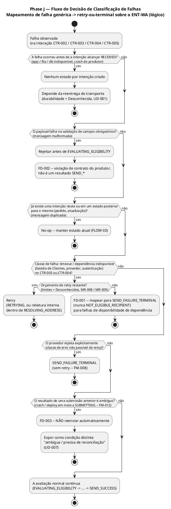
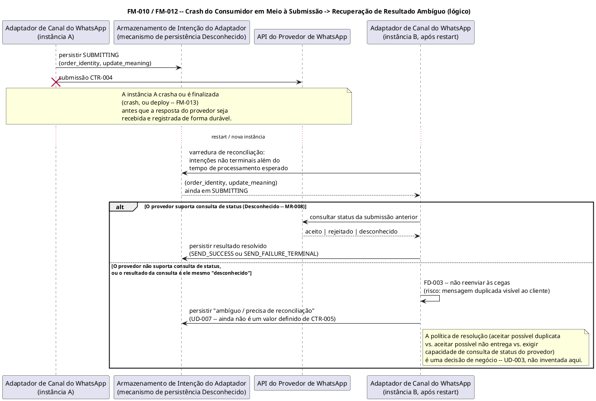
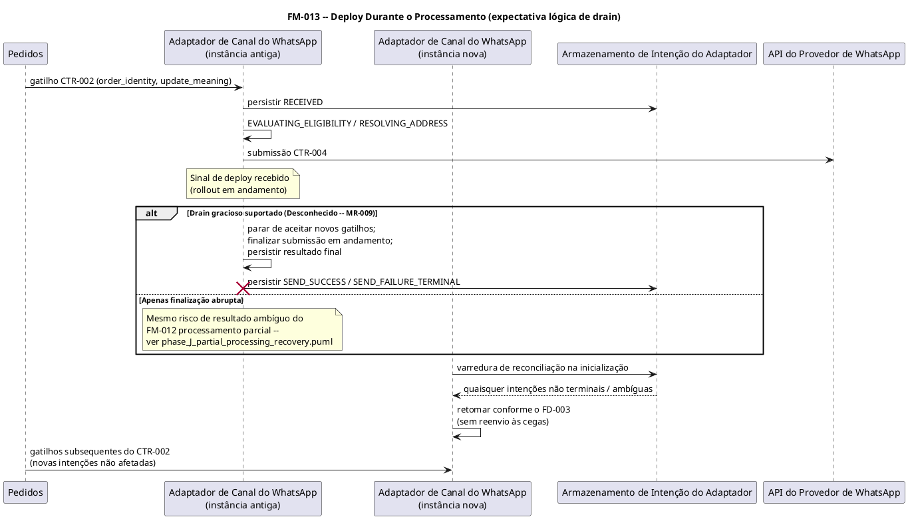

# Phase J — Política de Falha e Recuperação

Esta fase define **como o sistema se comporta quando componentes falham**: detecção, política de retry, estado terminal, caminho de recuperação, observabilidade e responsável — para as 13 categorias de falha abaixo. Ela resolve vários itens que fases anteriores adiaram explicitamente para esta fase (Phase F R-003/R-004/R-007, política terminal do FLOW-RR da Phase G, CR-4 e SC-5 da Phase I). Ela não inventa infraestrutura, contagens de retry, durações de timeout ou provedores que nenhuma fase anterior evidenciou — esses permanecem **Desconhecidos**, e o *formato* específico da política (passível de retry ou não, quem é responsável pela decisão) ainda é definido, para que nenhuma falha fique com comportamento indefinido.

---

## 1. Nota de metodologia — mapeando a lista genérica de falhas para esta arquitetura

Phase F/H estabeleceram que **nenhum banco de dados, fila, broker ou infraestrutura de aplicação adicional foi verificado** para esta tarefa (Phase F §1; Phase H "nenhum contrato de fila/broker é inventado"). O catálogo de falhas solicitado (aplicação, banco de dados, fila, consumidor, produtor, …) é um checklist genérico de sistemas distribuídos. Para analisá-lo sem inventar tecnologia, cada categoria genérica é mapeada para os elementos concretos e evidenciados das Phases F–I:

| Categoria genérica | Elemento concreto nesta arquitetura |
|---|---|
| "Aplicação" | Pedidos, Notificações por E-mail, Gestão de Clientes, Adaptador de Canal do WhatsApp — cada um como um componente em execução independente (Phase F §4) |
| "Banco de dados" | A persistência de intenção/resultado do Adaptador, implícita mas não desenhada pelo SC-1/SC-2 da Phase I e pelo CTR-005 da Phase H ("mecanismo de armazenamento Desconhecido") |
| "Fila" | O transporte que carrega o CTR-002 (Pedidos → Adaptador) e o CTR-005 (Adaptador → destino do resultado); a Phase H marca o protocolo/canal como **Desconhecido** para ambos |
| "Produtor" / "Consumidor" | Os papéis de Produtor/Consumidor que a Phase H já atribui por contrato (ex.: CTR-002: Produtor = Pedidos, Consumidor = Adaptador de Canal do WhatsApp) |
| "API externa" | API do Provedor de WhatsApp (CTR-004) |
| "Autenticação" | Chamadas com credenciais no CTR-003 (Adaptador → Gestão de Clientes) e CTR-004 (Adaptador → Provedor) |

Quando uma falha ocorre **antes** de uma intenção ser registrada de forma durável como `RECEIVED` (Phase I), ainda não existe estado por intenção — isso é, por si só, um comportamento terminal definido ("nenhum estado criado; depende de reentrega"), não uma omissão.

---

## 2. Framework de política de retry e estado terminal (regras compartilhadas)

Estas regras se aplicam aos 13 modos de falha e são referenciadas por ID na tabela da §4.

| ID | Regra |
|----|------|
| **FD-001** | Falhas de disponibilidade de dependência (Gestão de Clientes inacessível, provedor inacessível, timeout, falha de autenticação) que esgotam seu orçamento de retry resolvem para **`SEND_FAILURE_TERMINAL`** — **nunca** `NOT_ELIGIBLE_RECIPIENT`. `NOT_ELIGIBLE_RECIPIENT` significa "não existe endereço" (um fato de negócio/dado, conforme CTR-003); uma falha de disponibilidade significa "não conseguimos verificar" (um fato operacional). Confundir os dois esconderia indisponibilidades de dependência atrás de um resultado rotineiro e silenciosamente suprimido, comprometendo a visibilidade do REQ-DR-006. *(Resolve o CR-4 da Phase I.)* |
| **FD-002** | Uma mensagem malformada do CTR-002 é rejeitada **antes** de receber `RECEIVED`. É uma violação de contrato do produtor (classe de erro não passível de retry do CTR-002, Phase H), rastreada separadamente do vocabulário de resultado `SEND_*` — ela nunca recebe um `SEND_FAILURE` porque não existe uma chave `(order_identity, update_meaning)` válida à qual associá-lo. |
| **FD-003** | Após qualquer crash, restart ou deploy, o Adaptador **nunca deve reenviar às cegas** ao provedor (CTR-004) uma intenção cujo resultado de submissão anterior é desconhecido. A idempotência do lado do provedor é, ela mesma, Desconhecida (Phase H CTR-004), então um reenvio às cegas arrisca uma mensagem duplicada visível ao cliente. O destino ambíguo deve ser exposto como uma condição distinta e observável, em vez de ser automaticamente mapeado para sucesso ou falha terminal. |
| **FD-004** | Falhas de autenticação recebem **no máximo uma** tentativa de refresh-and-retry de credencial, depois são tratadas como não passíveis de retry e disparam um alerta em **nível de sistema** (não apenas por intenção) — uma falha de autenticação geralmente indica um problema sistêmico de credencial/configuração, não um problema pontual de mensagem, e retries idênticos repetidos arriscam um lockout. |
| **FD-005** | O retry só é tentado para a **mesma** intenção `(order_identity, update_meaning)` (Phase G FLOW-RR / Phase H CR-4) — nunca uma nova intenção, e nunca re-derivando a identidade do pedido ou do destinatário durante o retry. |

Limites numéricos de retry, backoff e durações de timeout **não** são inventados aqui — permanecem Desconhecidos até o MR-008 (provedor) / MR-009 (NFRs), de forma consistente com as Phases G/H/I. O que a Phase J fixa é a **lógica de decisão**: a qual classe uma falha pertence, e o que acontece quando o orçamento (ainda indefinido) se esgota.

---

## 3. Mapa de domínio de falhas

A qual contrato/componente cada categoria de falha realmente se relaciona, para que a §4 possa referenciá-los com precisão.

| Falha | Contrato(s)/Componente(s) principal(is) | Papéis de Produtor/Consumidor (Phase H) |
|---|---|---|
| Aplicação indisponível | Pedidos, Notificações por E-mail, Gestão de Clientes, Adaptador de Canal do WhatsApp (como componentes em execução) | — |
| Banco de dados indisponível | Armazenamento de intenção/resultado do Adaptador (implícito pelo SC-1/SC-2 da Phase I; mecanismo Desconhecido) | — |
| Fila indisponível | Transporte do CTR-002 e do CTR-005 (protocolo Desconhecido) | — |
| Mensagem malformada | Payload do CTR-002 | Produtor = Pedidos, Consumidor = Adaptador |
| Mensagem duplicada | Entrega do CTR-002 de uma chave já processada | Produtor = Pedidos, Consumidor = Adaptador |
| Mensagem fora de ordem | Sequenciamento de entrega do CTR-002 entre valores de `update_meaning` de um mesmo pedido | Produtor = Pedidos, Consumidor = Adaptador |
| Timeout | CTR-003 (Adaptador → Gestão de Clientes), CTR-004 (Adaptador → Provedor) | O Adaptador é cliente em ambos |
| Falha de API externa | CTR-004 | Adaptador = Produtor (chamador), Provedor = Consumidor (servidor) |
| Falha de autenticação | CTR-003, CTR-004 | O Adaptador é o chamador com credenciais em ambos |
| Crash do consumidor | Adaptador, em seu papel de Consumidor no CTR-002 | Consumidor = Adaptador |
| Crash do produtor | Pedidos, em seu papel de Produtor no CTR-002 | Produtor = Pedidos |
| Processamento parcial | Transições de estado internas do Adaptador (RECEIVED → … → SUBMITTING) + CTR-004 | Adaptador |
| Deploy durante o processamento | Runtime do Adaptador (principalmente; deploys de Pedidos/Notificações por E-mail são existentes/fora do escopo) | — |

---

## 4. Tabela de falha e recuperação

O vocabulário de resultado e os estados são do ENT-WA (Phase I), salvo indicação contrária. **Responsável** usa os rótulos de responsável por componente já estabelecidos na Phase F §4 (time de Pedidos; o time de Notificações é responsável por Notificações por E-mail *e* pelo Adaptador de Canal do WhatsApp; time de Gestão de Clientes; a integração com o provedor externo é de responsabilidade de Notificações via o Adaptador). Quando nenhuma fase anterior nomeia um time, **Não atribuído** é usado literalmente, seguindo a própria convenção da Phase D — não inventada aqui.

| # | Falha | Detecção | Retry | Estado Final | Recuperação | Observabilidade | Responsável |
|---|---|---|---|---|---|---|---|
| FM-001 | **Aplicação indisponível** | Sinal de saúde/liveness do componente (mecanismo Desconhecido, MR-009); para o Adaptador especificamente, ausência de acks de `RECEIVED` para envios conhecidos do CTR-002 | N/A em nível de intenção — nada a retentar até ficar acessível; governado pela durabilidade do transporte (ver FM-003) | Nenhum estado por intenção para gatilhos perdidos durante a janela de indisponibilidade (ver framework do FD-001; a §7 UD-001 sinaliza a lacuna de durabilidade) | Restart/failover do componente (preocupação de plataforma, MR-009, fora do escopo de desenho); o Adaptador retoma conforme o FM-010 para tudo que já estava `RECEIVED` | Sinal de saúde/uptime por componente, distinto dos resultados de envio do CTR-005 — uma aplicação indisponível não é um `SEND_FAILURE` | Time de Pedidos (Pedidos); time de Notificações (Notificações por E-mail, Adaptador); time de Gestão de Clientes (GC) — conforme Phase F §4 |
| FM-002 | **Banco de dados indisponível** (armazenamento de intenção/resultado do Adaptador) | Falha de escrita/leitura quando o Adaptador persiste ou verifica o estado de `(order_identity, update_meaning)` | Retry interno limitado contra o armazenamento antes de falhar a operação (contagem Desconhecida, MR-009); não deve prosseguir para o CTR-004 sem um registro durável (protege o SC-2) | Se indisponível antes de `RECEIVED` ser persistido: nenhum estado por intenção é criado (fail-closed, depende da reentrega do CTR-002). Se indisponível após `SUBMITTING` ter sido emitido: tratado como **FM-012 Processamento parcial** | Armazenamento restaurado → o Adaptador retoma; passagem de reconciliação para qualquer intenção presa em estado não terminal além do tempo de processamento esperado (`phase_J_partial_processing_recovery.puml`) | Sinal de saúde do armazenamento, distinto do CTR-005; alerta baseado em idade de "intenção presa" (limiar Desconhecido) | Adaptador de Canal do WhatsApp / time de Notificações (Phase F AD-001/AD-006 — o Adaptador é responsável pelo próprio estado) |
| FM-003 | **Fila indisponível** (transporte do CTR-002 / CTR-005) | Falha de envio no lado do produtor ou transporte inacessível no lado do consumidor (protocolo Desconhecido, MR-008) | Totalmente governado pelo transporte escolhido (Desconhecido); a arquitetura exige entrega durável/at-least-once como NFR (MR-009), mas não determina uma tecnologia aqui | Nenhum estado por intenção para gatilhos que nunca chegam ao Adaptador (`RECEIVED` nunca ocorre); apenas o que o transporte reteve é recuperável quando restaurado | Recuperação em nível de transporte (preocupação de plataforma); o Adaptador não tem como recuperar o que o transporte não reteve | Sinal de saúde/backlog do transporte (ferramenta Desconhecida); a divergência entre a contagem de gatilhos do lado de Pedidos e a contagem de `RECEIVED` do lado do Adaptador é um sinal indireto (mecanismo de reconciliação não desenhado aqui) | Não atribuído — nenhum time é responsável pelo transporte/protocolo até que o MR-008 seja resolvido (a lacuna de responsabilidade da Phase D se estende aqui) |
| FM-004 | **Mensagem malformada** | Validação em nível de campo no recebimento do CTR-002 (`order_identity`, `update_meaning` ou `end_customer_reference` ausente/inválido), antes de `EVALUATING_ELIGIBILITY` | **Não é retentada** — o mesmo payload falha de forma idêntica em uma reentrega (classe não passível de retry do CTR-002, Phase H); **FD-002** | Rejeitada na entrada; nunca recebe `RECEIVED`; não é mapeada para o vocabulário `SEND_*` (não existe uma chave válida) | O produtor (Pedidos) precisa reenviar um gatilho corrigido; não há reparo/valor padrão de campo do lado do Adaptador | Sinal de rejeição de schema distinto do CTR-005 (destino Desconhecido); não deve ser descartado silenciosamente sem nenhum rastro | Detecção: Adaptador de Canal do WhatsApp / time de Notificações. Correção: time de Pedidos (responsável pelo contrato de produtor do CTR-002) |
| FM-005 | **Mensagem duplicada** | Intenção existente já encontrada para `(order_identity, update_meaning)` em qualquer estado não inicial (Phase G FLOW-ID / tabela de transição de duplicata da Phase I) | N/A — suprimida, não retentada | Sticky — permanece no estado em que a intenção existente já está (ex.: permanece `SEND_SUCCESS`; reabrir um estado terminal não elegível/falho é Desconhecido, Phase I) | Nenhuma recuperação necessária — supressão correta por design (mitiga o CR-2 da Phase I) | Contador de duplicatas recebidas, distinguível do contador de novas intenções; exatamente um sinal autoritativo de CTR-005 por chave | Adaptador de Canal do WhatsApp / time de Notificações |
| FM-006 | **Mensagem fora de ordem** | **Não existe mecanismo** em nenhuma fase anterior para detectar isso — o CTR-002 declara "sem requisito de ordenação" (Phase H); a reordenação com a mesma chave colapsa no FM-005, mas valores diferentes de `update_meaning` no mesmo pedido são chaves independentes sem verificação de sequenciamento | N/A — não é um erro transitório, é uma propriedade de sequenciamento | Ambas as intenções podem alcançar `SEND_SUCCESS` de forma independente, independentemente da ordem real dos eventos; os contratos atuais não protegem contra entrega fora de sequência visível ao cliente | **Nenhuma desenhada** — não existe buffer de retenção/reordenação nas Phases F–I, e introduzir um excederia o limite de "nenhuma infraestrutura nova" da Phase F | Não especificado — a corretude do sequenciamento é atualmente não verificável | Não atribuído — lacuna genuína; ver **UD-002** |
| FM-007 | **Timeout** | Nenhuma resposta dentro do limite de tempo da operação no CTR-003 ou CTR-004 (duração Desconhecida, MR-009) | Timeout do CTR-003 → tratado como falha de disponibilidade de dependência (caminho do FD-001). Timeout do CTR-004 → tratado como `SEND_FAILURE`, elegível para o FLOW-RR (limitado, limites Desconhecidos) | Retries esgotados em qualquer um dos contratos → `SEND_FAILURE_TERMINAL` (FD-001). A ambiguidade de timeout do provedor (a mensagem pode ter sido aceita no lado do servidor apesar da resposta perdida) **não** é resolvida automaticamente — ver FM-012 / **UD-003** | Caminho de retry padrão do FLOW-RR (Phase G); uma vez esgotado, terminal | Timeout distinguível de uma rejeição explícita quando a dependência suporta isso (Desconhecido); caso contrário, aparece de forma idêntica a `SEND_FAILURE` → `SEND_FAILURE_TERMINAL` | Adaptador de Canal do WhatsApp / time de Notificações (tratamento); time de Gestão de Clientes (causa raiz do CTR-003) |
| FM-008 | **Falha de API externa** (API do Provedor de WhatsApp) | Resposta do CTR-004 indica rejeição / erro / indisponibilidade (Phase G FLOW-FL) | Erros de classe passível de retry → `RETRYING` (limitado, limites a definir MR-008/MR-009). Classe não passível de retry (ex.: destino permanentemente inválido) → `SEND_FAILURE_TERMINAL` imediatamente, sem retry. A classificação concreta de código de erro é Desconhecida até o MR-008, mas a estrutura de duas classes é fixada aqui | `SEND_SUCCESS` (tentativa posterior) ou `SEND_FAILURE_TERMINAL` | FLOW-RR (Phase G `phase_G_retry_recovery.puml`) | CTR-005 `SEND_SUCCESS` / `SEND_FAILURE`; id de correlação do provedor quando disponível (Desconhecido) | Adaptador de Canal do WhatsApp / time de Notificações (integração); causa raiz = provedor externo (Phase F: integração de responsabilidade de Notificações via o Adaptador) |
| FM-009 | **Falha de autenticação** | Resposta de erro de classe de autenticação (ex.: equivalente a 401; códigos concretos Desconhecidos) da GC (CTR-003) ou do Provedor (CTR-004) | No máximo **uma** tentativa de refresh-and-retry (**FD-004**); falhas de autenticação idênticas repetidas não são passíveis de retry — retentar com a mesma credencial inválida não pode ter sucesso e arrisca um lockout | Esgotado → `SEND_FAILURE_TERMINAL` no contrato afetado (caminho do FD-001) | Rotação/correção de credencial (operacional, responsável Não atribuído); isso tipicamente bloqueia **todas** as intenções, não apenas uma, então não deve ser tratado como uma falha isolada por intenção | Deve ser distinguível de um `SEND_FAILURE` rotineiro — um cluster de `SEND_FAILURE_TERMINAL` compartilhando uma causa de classe de autenticação é, por si só, um sinal sistêmico (mecanismo de correlação Desconhecido) | Detecção: Adaptador de Canal do WhatsApp / time de Notificações. Responsável pelas credenciais: Não atribuído (nenhum responsável por secrets/plataforma é nomeado em nenhuma fase anterior) |
| FM-010 | **Crash do consumidor** (o Adaptador crasha em meio ao processamento, em seu papel de Consumidor no CTR-002) | No restart, a varredura de reconciliação encontra intenções que permaneceram não terminais além do esperado no armazenamento persistido | Retoma a partir do último estado persistido de forma durável, nunca reinicia às cegas: crash antes de `RECEIVED` → depende da reentrega do transporte (FM-003); crash após `RECEIVED` mas antes de `SUBMITTING` → seguro retomar a avaliação; crash durante/após `SUBMITTING` → **FM-012** | Mesmo vocabulário-alvo do processamento normal (`SEND_SUCCESS` / `SEND_FAILURE_TERMINAL` / `NOT_ELIGIBLE_*`), alcançado por processamento retomado, não um novo estado | Ver `phase_J_partial_processing_recovery.puml` | Evento de restart + contagem de intenções não terminais retomadas; alerta de idade de intenção presa | Adaptador de Canal do WhatsApp / time de Notificações |
| FM-011 | **Crash do produtor** (Pedidos crasha, em seu papel de Produtor no CTR-002) | Redesenhar Pedidos está fora do escopo (Phase D OOS-001); do lado do Adaptador, isso é indistinguível de "nenhum gatilho chegando" (mesma assinatura do FM-001/FM-003) | N/A no Adaptador — nada foi recebido | Nenhum estado por intenção para momentos que ocorreram enquanto Pedidos estava fora do ar e nunca foram emitidos | A recuperação de crash do próprio Pedidos é existente/fora do escopo. Se Pedidos **reprocessa/reproduz** (backfill/replay) os momentos perdidos ao se recuperar é **indefinido** — ver **UD-004** | Monitoramento de disponibilidade do próprio Pedidos (fora do escopo); o Adaptador não consegue distinguir isso de silêncio | Time de Pedidos (Phase F §4) |
| FM-012 | **Processamento parcial** (crash/falha entre subpassos confirmados de uma intenção — criticamente, submissão enviada mas resultado não registrado) | Intenção encontrada em `SUBMITTING` além do tempo de processamento esperado durante uma varredura de reconciliação (restart ou periódica) | **Não deve reenviar às cegas** (**FD-003**) — a idempotência do lado do provedor é Desconhecida (Phase H CTR-004), então um reenvio às cegas arrisca uma mensagem duplicada ao cliente. Se o provedor suportar uma consulta de status (Desconhecido, MR-008), use-a para resolver; caso contrário, a ambiguidade não tem resolução automática segura | **Não resolvida automaticamente** para `SEND_SUCCESS` ou `SEND_FAILURE_TERMINAL` por esta fase — mantida explicitamente como uma condição ambígua (**UD-003**, **UD-007**) em vez de adivinhada | Ver `phase_J_partial_processing_recovery.puml` — documenta os dois caminhos de resolução candidatos sem selecionar um | Deve ser exposta como um sinal **distinto**, não assumida silenciosamente em um resultado existente (estende o SC-5 da Phase I) | Detecção/exposição: Adaptador de Canal do WhatsApp / time de Notificações. Política de resolução: Não atribuído (decisão de negócio, adjacente ao MR-008) |
| FM-013 | **Deploy durante o processamento** | Sinal de deploy/rollout (em nível de plataforma, mecanismo Desconhecido, MR-009) correlacionado com intenções em `SUBMITTING` / `RETRYING` no momento da finalização da instância | Regras idênticas às do FM-010/FM-012 se aplicam após o restart — um restart induzido por deploy é tratado exatamente como um crash do ponto de vista da intenção | Mesmo vocabulário do ENT-WA; nenhum estado terminal específico de deploy | Drain gracioso (finalizar ou fazer checkpoint com segurança das intenções em andamento antes de encerrar uma instância) é a propriedade desejada; se o runtime suporta isso é Desconhecido (MR-009) — se apenas a finalização abrupta estiver disponível, todo deploy carrega o risco do FM-012 | Evento de deploy correlacionado com qualquer pico de intenções ambíguas/presas logo depois | Adaptador de Canal do WhatsApp / time de Notificações (prática de deploy); capacidade de plataforma subjacente: Não atribuído |

**Autoverificação:** toda linha acima tem uma decisão de Retry não vazia (incluindo "N/A" explícito com justificativa), um Estado Final definido (incluindo "nenhum estado por intenção, por design" explícito quando aplicável), e um Responsável nomeado ou explicitamente Não atribuído — nenhuma célula em branco.

---

## 5. Fluxos de recuperação complexos (diagramas)

### 5.1 Fluxo de decisão de classificação de falhas

**Diagrama:** `phase_J_failure_classification.puml`

Consolida a lógica de ramificação de retry/terminal usada em FM-004, FM-005, FM-007, FM-008, FM-009 e FM-012 em um único fluxo de decisão, para que as regras de classificação da §2 sejam rastreáveis a um único mecanismo, em vez de repetidas de forma independente por falha.

### 5.2 Recuperação de processamento parcial / crash do consumidor

**Diagrama:** `phase_J_partial_processing_recovery.puml`

Cobre o FM-010 e o FM-012 — o caso de maior risco, em que um crash ocorre depois que uma submissão foi enviada ao provedor, mas antes que seu resultado seja registrado de forma durável.

### 5.3 Drain durante deploy em processamento

**Diagrama:** `phase_J_deployment_drain.puml`

Cobre o FM-013, mostrando que um deploy gracioso é a propriedade desejada, mas converge para o mesmo tratamento de resultado ambíguo da §5.2 se apenas a finalização abrupta estiver disponível.

---

## 6. Decisões formais tomadas nesta fase

| ID | Decisão | Resolve |
|----|----------|----------|
| FD-001 | Falhas de disponibilidade de dependência (GC/provedor inacessível, timeout, autenticação) que esgotam o retry mapeiam para `SEND_FAILURE_TERMINAL`, nunca `NOT_ELIGIBLE_RECIPIENT` | CR-4 da Phase I |
| FD-002 | Mensagens malformadas do CTR-002 são rejeitadas antes de `RECEIVED`; não fazem parte do vocabulário `SEND_*` | Contrato de erro do CTR-002 da Phase H (aplicado) |
| FD-003 | Nenhum reenvio às cegas após crash/deploy quando o destino de uma submissão anterior é desconhecido; a ambiguidade é uma condição distinta e exposta | "Idempotência nativa do provedor = Desconhecida" da Phase H; SC-2 da Phase I |
| FD-004 | Falhas de autenticação recebem uma tentativa de refresh-and-retry, depois não são passíveis de retry e disparam um alerta em nível de sistema | Novo (nenhuma fase anterior tratou de autenticação) |
| FD-005 | O retry sempre tem como alvo a mesma chave `(order_identity, update_meaning)`, nunca uma rederivada | Reafirma o FLOW-RR da Phase G / CR-4 da Phase H |

---

## 7. Decisões não resolvidas

De forma consistente com as Phases C–I, valores e mecanismos não evidenciados por nenhuma fase anterior **não são inventados**. Estes bloqueiam uma política de falha totalmente implementável:

| ID | Decisão não resolvida | Depende de / Bloqueia |
|----|----------------------|----------------------|
| UD-001 | Se o transporte do CTR-002 / CTR-005 garante entrega durável at-least-once (como fila) ou pode descartar silenciosamente durante uma indisponibilidade (como chamada síncrona) | MR-008 (seleção de protocolo/provedor); afeta se o FM-001/003/011 pode perder um momento permanentemente |
| UD-002 | Se as mensagens de WhatsApp precisam preservar a ordem de eventos de negócio entre diferentes valores de `update_meaning` do mesmo pedido, e quem impõe isso | Nenhum mecanismo existe hoje (FM-006); responsável não atribuído |
| UD-003 | Política de resolução para resultados ambíguos de processamento parcial (FM-012): aceitar possível duplicata vs. aceitar possível não entrega vs. exigir capacidade de consulta de status do provedor | MR-008 (capacidade do provedor); decisão de risco de negócio |
| UD-004 | Se Pedidos reprocessa/reproduz (backfill/replay) momentos do ciclo de vida do pedido perdidos durante uma indisponibilidade do produtor (FM-011) | Time de Pedidos; afeta se os clientes perdem permanentemente tanto o e-mail quanto o WhatsApp para esses momentos |
| UD-005 | Contagens concretas de retry, curvas de backoff e durações de timeout para cada classe passível de retry na §4 | MR-008 (limites do provedor) / MR-009 (NFRs) — o formato da política é fixado aqui, os valores não |
| UD-006 | Responsável pela infraestrutura compartilhada: transporte/fila, credenciais/secrets, plataforma de deploy | Nenhum time é nomeado na Phase D/F para isso; estende as lacunas de responsabilidade já existentes na Phase D (OG-003, OG-010) |
| UD-007 | Se o vocabulário de resultado precisa de um novo valor explícito (ex.: "ambíguo / precisa de reconciliação") para o FM-012, ou se ele permanece puramente interno e nunca chega ao CTR-005 | Phase H: extensões de enum precisam se manter retrocompatíveis para os consumidores; não decidido aqui |
| UD-008 | Se um retry precisa reverificar o gate de consentimento/envio permitido (MR-005) caso o consentimento possa ter mudado entre a tentativa original e um retry | MR-005 ainda não definido por nenhuma fase; a interação com retry não havia sido considerada antes |

---

## 8. Regras transversais (estende a §"Regras entre contratos" da Phase H / §"Requisitos de consistência de estado" da Phase I)

| Regra | Enunciado |
|------|-----------|
| XR-1 | Um incidente de disponibilidade de componente (FM-001/002/003) nunca é reportado através do CTR-005 como um `SEND_FAILURE` — é um sinal de sistema/infraestrutura, não um resultado por intenção |
| XR-2 | Nenhum tratamento de falha do WhatsApp pode alterar o estado do Pedido ou o próprio ciclo de vida de Notificações por E-mail (reafirma o AD-006 da Phase F, as transições inválidas do ENT-ORD da Phase I) |
| XR-3 | Todo retry, para qualquer classe de falha, tem como alvo a mesma chave `(order_identity, update_meaning)` (FD-005) |
| XR-4 | Um resultado ambíguo (FM-012) é exposto de forma distinta e nunca é assumido silenciosamente como `SEND_SUCCESS` ou `SEND_FAILURE_TERMINAL` |
| XR-5 | O responsável pela detecção nem sempre é o mesmo responsável pela correção da causa raiz (ex.: FM-004: o Adaptador detecta, o time de Pedidos corrige; FM-009: o Adaptador detecta, o responsável pela credencial — Não atribuído — corrige) — ambos devem ser rastreados, não apenas um |

---

## Avaliação Final

O comportamento de falha está **definido em nível lógico/de política** para as 13 categorias solicitadas: mecanismo de detecção, classificação de retry, estado terminal (ou o resultado explícito "nenhum estado por intenção"), caminho de recuperação, sinal de observabilidade e responsável são declarados para cada uma — nenhuma em branco.

**Ainda não implementável** até que: o transporte/protocolo seja escolhido (MR-008), os limites de NFR sejam definidos (MR-009), e as decisões de negócio da §7 (especialmente a política de resolução de processamento parcial do UD-003 e a política de backfill de indisponibilidade do produtor do UD-004) sejam tomadas — essas são decisões genuinamente em aberto, não lacunas nesta análise.

**Pronto para:** desenho de implementação e a matriz de testes da Phase N (os casos de teste de injeção de falha mapeiam diretamente para FM-001–FM-013).

### Índice de diagramas

| Arquivo | Conteúdo |
|------|---------|
| `phase_J_failure_classification.puml` | Falha genérica → fluxo de decisão de retry/terminal |
| `phase_J_partial_processing_recovery.puml` | Crash do consumidor em meio à submissão → recuperação de resultado ambíguo |
| `phase_J_deployment_drain.puml` | Expectativa de drain durante deploy em processamento |

---

## Artefato Compartilhado

### Resumo de falha e recuperação (Episódio 1)

Para cada categoria de falha, o Adaptador de Canal do WhatsApp a classifica como **pré-intenção** (ainda não existe registro de `(pedido, atualização)` — a recuperação depende inteiramente da reentrega do transporte, que é Desconhecida), **passível de retry** (limitado, mesma chave de intenção, limites a definir) ou **terminal** (`SEND_FAILURE_TERMINAL`, `NOT_ELIGIBLE_MOMENT`, `NOT_ELIGIBLE_RECIPIENT`, ou `SEND_SUCCESS`). Falhas de indisponibilidade de dependência (GC, provedor, autenticação) que esgotam o retry sempre se tornam `SEND_FAILURE_TERMINAL`, nunca um resultado não elegível — essa distinção protege a visibilidade do REQ-DR-006. Após qualquer crash ou deploy, o Adaptador nunca reenvia às cegas quando o destino de uma submissão anterior é desconhecido; ele expõe essa ambiguidade explicitamente em vez de adivinhar. Duas categorias — entrega fora de ordem entre diferentes atualizações de pedido, e o backfill de indisponibilidade do produtor — **não têm mecanismo definido** em nenhuma fase anterior e são registradas como decisões de negócio em aberto, não assumidas silenciosamente.
