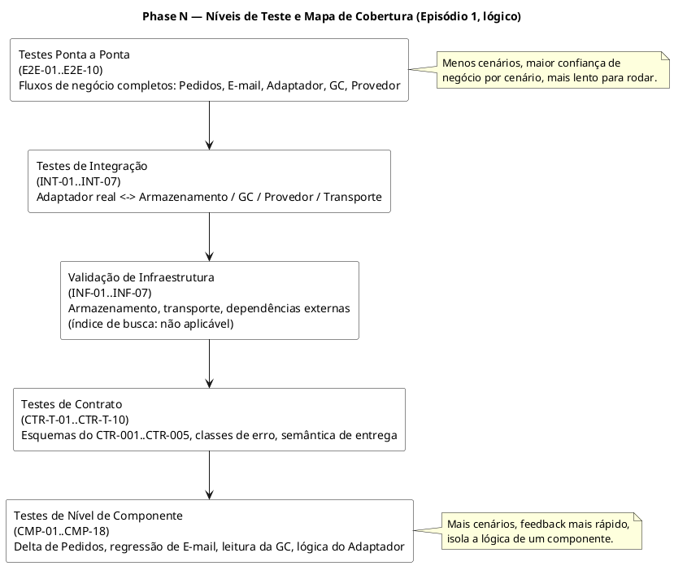

# Phase N — Estratégia de Validação e Cenários de Teste

Esta fase define **cenários de validação**, não código de teste. Todo cenário está ancorado a um requisito (Phase C `REQ-EX-*` / `REQ-DR-*`), um fluxo (Phase G `FLOW-*`), um contrato (Phase H `CTR-*`), um estado ou transição (Phase I `ENT-WA` / `SC-*`), um modo de falha (Phase J `FM-*` / `FD-*`), ou um sinal observável (Phase M `EVT-*`). Nenhum mecanismo, ferramenta ou valor numérico novo é introduzido para tornar um cenário "mais limpo" — quando a execução de um cenário depende de algo ainda não resolvido (MR-005, MR-008, MR-009, MOR-001), ele é marcado como **Bloqueado, pendente de esclarecimento** e listado novamente na §7.

---

## 0. Como ler esta fase

**Níveis de teste**, do mais estreito ao mais amplo:

1. **Nível de Componente** — uma aplicação/componente isolado (o delta de Pedidos, a superfície de regressão de Notificações por E-mail, a leitura da Gestão de Clientes, a lógica do Adaptador de Canal do WhatsApp)
2. **Testes de Contrato** — a própria interface (`CTR-001`–`CTR-005`): esquema, campos obrigatórios/opcionais, classes de erro, semântica de entrega — independente da lógica de negócio de qualquer um dos lados
3. **Validação de Infraestrutura** — o armazenamento e o transporte dos quais o Adaptador depende, além das dependências externas, exercitados diretamente
4. **Testes de Integração** — a aplicação real conversando com a ferramenta/dependência real (não uma verificação de forma de contrato, uma chamada de fato)
5. **Ponta a Ponta** — um fluxo de negócio completo por todos os componentes, correspondendo a um fluxo da Phase G

**Mapeando as categorias genéricas de infraestrutura solicitadas para esta arquitetura** (mesma disciplina que a Phase J usou para categorias de falha — Phase F/H verificaram que não há banco de dados, fila ou broker para esta tarefa, então nenhum é inventado aqui também):

| Categoria genérica | Elemento concreto nesta arquitetura |
|---|---|
| Banco de dados | O armazenamento de intenção/resultado do Adaptador (mecanismo de persistência Desconhecido, Phase J FM-002) |
| Fila / broker | O transporte do `CTR-002` / `CTR-005` (protocolo Desconhecido, Phase J FM-003, UD-001) |
| Índice de busca | **Não aplicável.** Catálogo de Produtos/Busca está fora do escopo desta tarefa (Phase C NR-002, Phase D OOS-002) — nenhum cenário é definido; inventar um excederia o escopo verificado |
| Dependência externa | Gestão de Clientes (GC, do lado do Adaptador) e a API do Provedor de WhatsApp (sistema verdadeiramente externo) |

**Convenção de rastreabilidade.** "ID do Requisito" cita a obrigação da Phase C que o cenário prova ou protege. Quando o mecanismo de um cenário ainda está em aberto, a célula diz isso explicitamente em vez de presumir uma resposta.

---

## 1. Testes de Nível de Componente

### 1.1 Pedidos (apenas o delta — emissão do CTR-002; Pedidos em si não é redesenhado)

| Cenário | ID do Requisito | Nível de Teste | Estado Inicial | Entrada | Execução Esperada | Saída Esperada | Estado Final Esperado | Justificativa de Negócio | Risco de Produção Evitado |
|---|---|---|---|---|---|---|---|---|---|
| **CMP-01** — Pedidos emite o CTR-002 para um momento dentro do escopo (caminho feliz) | REQ-DR-001, REQ-DR-002 | Componente | Pedido existe; ocorre uma atividade correspondente a um momento equivalente ao gatilho de e-mail | Um momento do ciclo de vida do pedido dentro do escopo | Pedidos emite tanto o gatilho CTR-001 existente quanto o novo gatilho CTR-002 para o mesmo momento | Mensagem CTR-002 produzida com `order_identity`, `update_meaning`, `end_customer_reference`; CTR-001 não afetado | Estado do pedido inalterado ao emitir o CTR-002; Pedidos não espera pelo Adaptador | O WhatsApp deve disparar nos mesmos momentos de negócio reais que o e-mail (regra do MVP do workshop, AD-003) | Os catálogos de eventos de Pedidos e do Adaptador divergirem silenciosamente — momentos errados notificados, ou nenhum |
| **CMP-02** — Pedidos não emite o CTR-002 para um momento fora do escopo | REQ-DR-001 | Componente | Ocorre uma atividade de pedido que não é um momento equivalente ao gatilho de e-mail | Atividade de pedido fora do escopo | Pedidos não emite nada para o Adaptador (e nada para Notificações por E-mail para essa atividade, como hoje) | Nenhuma mensagem CTR-002 produzida | Nenhuma intenção de WhatsApp criada para essa atividade | O escopo do MVP é fixado nos mesmos momentos do e-mail (AD-003) | Aumento descontrolado do escopo de eventos — WhatsApp disparando para momentos nunca aprovados |

### 1.2 Notificações por E-mail (preservação de comportamento — não redesenhado)

| Cenário | ID do Requisito | Nível de Teste | Estado Inicial | Entrada | Execução Esperada | Saída Esperada | Estado Final Esperado | Justificativa de Negócio | Risco de Produção Evitado |
|---|---|---|---|---|---|---|---|---|---|
| **CMP-03** — E-mail envia sem alteração com o caminho WhatsApp presente (regressão) | REQ-DR-005 | Componente | Momento dentro do escopo ocorre; o Adaptador de Canal do WhatsApp existe na arquitetura | O mesmo momento dentro do escopo de antes desta funcionalidade existir | Notificações por E-mail processa o CTR-001 exatamente como antes do Episódio 1 | E-mail enviado conforme o comportamento existente, não afetado pela presença ou estado do Adaptador | Resultado do e-mail registrado exatamente como antes desta funcionalidade | A política de complemento exige que o canal existente continue funcionando sem alteração (AD-002) | O WhatsApp degradar, atrasar ou duplicar silenciosamente as notificações de e-mail existentes |

### 1.3 Gestão de Clientes (leitura existente, exercitada — não redesenhada)

| Cenário | ID do Requisito | Nível de Teste | Estado Inicial | Entrada | Execução Esperada | Saída Esperada | Estado Final Esperado | Justificativa de Negócio | Risco de Produção Evitado |
|---|---|---|---|---|---|---|---|---|---|
| **CMP-04** — Retorna endereçamento utilizável quando presente (caminho feliz) | REQ-DR-003 | Componente | O cliente final do pedido tem dados de contato compatíveis com WhatsApp cadastrados | Um `end_customer_reference` válido | A GC resolve a referência e retorna o endereçamento | `addressing_available = true`; `whatsapp_addressing` preenchido | Nenhum dado da GC alterado (somente leitura, AD-004) | O endereçamento do destinatário deve vir do sistema de registro existente, nunca inventado | O Adaptador fabricar ou cachear um endereço fora da posse da GC |
| **CMP-05** — Indica ausência de endereçamento utilizável quando não há (dados ausentes) | REQ-DR-003 | Componente | O cliente final não tem dados de contato compatíveis com WhatsApp cadastrados | Um `end_customer_reference` válido para esse cliente | A GC realiza a mesma lógica de leitura e não encontra valor utilizável | `addressing_available = false` | Nenhum dado da GC alterado; nenhum endereço-placeholder fabricado é retornado | Endereçamento ausente deve ser distinguível de uma falha de sistema (CR-3) | "Sem endereço cadastrado" ser confundido com um erro técnico, escondendo uma lacuna real de qualidade de dados (Phase F R-001) |
| **CMP-06** — Rejeita uma referência inválida/não reconhecida (entrada inválida) | REQ-DR-003 | Componente | A referência não corresponde a nenhum cliente final conhecido | `end_customer_reference` malformado ou desconhecido | A leitura da GC falha na validação antes de qualquer busca de dado | Um erro de referência inválida, não passível de retry, distinto de "sem endereço cadastrado" | Nenhum dado da GC alterado | A classe de erro não passível de retry do CTR-003 deve ser distinguível (Phase H) | O Adaptador retentar para sempre um erro de entrada não corrigível, escondendo um bug real de integração |

### 1.4 Adaptador de Canal do WhatsApp (componente novo — lógica principal)

| Cenário | ID do Requisito | Nível de Teste | Estado Inicial | Entrada | Execução Esperada | Saída Esperada | Estado Final Esperado | Justificativa de Negócio | Risco de Produção Evitado |
|---|---|---|---|---|---|---|---|---|---|
| **CMP-07** — Aceita um momento dentro do escopo, avança para o endereçamento (caminho feliz) | REQ-DR-001 | Componente | Intenção `RECEIVED` para um momento dentro do escopo | Gatilho CTR-002 | O Adaptador avalia a elegibilidade: `RECEIVED → EVALUATING_ELIGIBILITY → RESOLVING_ADDRESS` | Intenção avança rumo à resolução de endereçamento | `RESOLVING_ADDRESS` | Apenas momentos dentro do escopo podem avançar rumo a uma submissão ao provedor (AD-003) | Enviar WhatsApp para momentos nunca aprovados para o canal |
| **CMP-08** — Rejeita um momento fora do escopo | REQ-DR-001 | Componente | Intenção `RECEIVED` para um momento fora do inventário de gatilhos de e-mail | Gatilho CTR-002 para esse momento | O Adaptador avalia e para antes da resolução de endereçamento | Resultado `NOT_ELIGIBLE_MOMENT` | Terminal `NOT_ELIGIBLE_MOMENT`; CTR-004 nunca chamado | Phase G NE-A | Aumento descontrolado de escopo chegando à produção |
| **CMP-09** — Endereçamento ausente mapeia para destinatário não elegível, não uma falha | REQ-DR-003, REQ-DR-006 | Componente | Intenção elegível em `RESOLVING_ADDRESS` | CTR-003 retorna `addressing_available = false` | O Adaptador para antes de qualquer chamada ao CTR-004 | Resultado `NOT_ELIGIBLE_RECIPIENT` | Terminal `NOT_ELIGIBLE_RECIPIENT` | CR-3 — o CTR-004 nunca deve ser chamado sem endereçamento utilizável | Alertas falsos de "falha de envio" para um problema de dado; chamadas ao provedor desperdiçadas/erradas |
| **CMP-10** — Submissão bem-sucedida alcança `SEND_SUCCESS` (caminho feliz) | REQ-DR-004, REQ-DR-006 | Componente | `SUBMITTING` | CTR-004 retorna aceito | O Adaptador registra `SEND_SUCCESS` | Resultado do CTR-005 = `SEND_SUCCESS` | Terminal `SEND_SUCCESS` | Esta é a prova observável de que o REQ-EX-001 aconteceu | Não haver como confirmar que a única capacidade obrigatória pedida pelo negócio realmente ocorreu |
| **CMP-11** — Rejeição do provedor mapeia para `SEND_FAILURE`, e-mail não afetado | REQ-DR-006, REQ-DR-005 | Componente | `SUBMITTING`; caminho de e-mail já concluído de forma independente | CTR-004 retorna rejeitado/falhou | O Adaptador registra `SEND_FAILURE` sem tocar no estado do Pedido ou de Notificações por E-mail | Resultado do CTR-005 = `SEND_FAILURE` | `SEND_FAILURE` (ou `RETRYING` se passível de retry); resultado do e-mail inalterado | AD-006 — nunca derivar o status do WhatsApp a partir do e-mail ou vice-versa | Uma indisponibilidade do WhatsApp reverter ou bloquear silenciosamente o processamento não relacionado de pedido/e-mail |
| **CMP-12** — Falha passível de retry se recupera para sucesso (retries) | REQ-DR-004, REQ-DR-006 | Componente | `SEND_FAILURE`, classificada como passível de retry | Tentativa de retry agendada; o provedor agora aceita | O Adaptador reenvia para a mesma chave `(order_identity, update_meaning)` (FD-005): `RETRYING → SUBMITTING → SEND_SUCCESS` | Resultado final único do CTR-005 = `SEND_SUCCESS` | Terminal `SEND_SUCCESS`; exatamente uma mensagem visível ao cliente | FLOW-RR — falhas transitórias não podem virar perdas permanentes | Clientes perderem permanentemente uma notificação por causa de uma falha transitória |
| **CMP-13** — Orçamento de retry esgotado alcança falha terminal | REQ-DR-006 | Componente | `SEND_FAILURE`; retries esgotados (o limite em si é Desconhecido, Phase K NFR-REL-001 — isso valida a *regra de transição*, não uma contagem) | Nenhum retry adicional permitido | O Adaptador classifica como `SEND_FAILURE_TERMINAL` conforme o FD-001 | Resultado do CTR-005 = `SEND_FAILURE_TERMINAL` | Terminal `SEND_FAILURE_TERMINAL`; sempre alertado (Phase M EVT-06) | Uma falha deve eventualmente resolver para um estado terminal visível | Uma intenção retentando para sempre, invisível aos operadores |
| **CMP-14** — Gatilho duplicado após sucesso é suprimido | REQ-DR-002 | Componente | Intenção já em `SEND_SUCCESS` para `(O, U)` | Uma segunda entrega do CTR-002 para o mesmo `(O, U)` | O Adaptador reconhece o estado terminal existente; não toma nenhuma ação com o provedor | Nenhuma segunda chamada ao CTR-004; CTR-005 inalterado | `SEND_SUCCESS`, inalterado | FLOW-ID — uma mensagem visível ao cliente por atualização real | Mensagens de WhatsApp duplicadas/indesejadas para um evento de pedido |
| **CMP-15** — Resultado ambíguo após crash em meio à submissão nunca é resolvido automaticamente | REQ-DR-006 | Componente | Intenção estava em `SUBMITTING` quando a instância do Adaptador crashou | Varredura de reconciliação encontra a intenção ainda em `SUBMITTING` além do tempo de processamento esperado; o provedor não oferece uma consulta de status confiável | O Adaptador **não** reenvia às cegas (FD-003) | Intenção exposta como um sinal distinto de "ambíguo / precisa de reconciliação" — não `SEND_SUCCESS` nem `SEND_FAILURE_TERMINAL` | Não terminal, condição sinalizada pendente de uma decisão de negócio (UD-003) | Evita adivinhar entre "talvez já enviado" e "definitivamente não enviado" | Mensagem duplicada ao cliente (se reenviado por engano) ou uma notificação silenciosamente perdida (se marcado como falha por engano) |
| **CMP-16** — Falha de autenticação recebe um refresh-retry, depois um alerta de sistema | REQ-DR-004 | Componente | Adaptador prestes a chamar o CTR-003 ou CTR-004 com uma credencial expirada/inválida | Resposta de erro de classe de autenticação | O Adaptador realiza exatamente uma tentativa de refresh-and-retry de credencial (FD-004); nenhum retry idêntico adicional | Um alerta em nível de sistema, distinto de um `SEND_FAILURE` rotineiro (Phase M EVT-11) | `SEND_FAILURE_TERMINAL` para intenções em andamento nessa dependência, mais uma condição em nível de sistema | Uma credencial quebrada é problema de todo mundo, não de uma única mensagem | Retries repetidos de credencial inválida arriscando um lockout de conta; uma indisponibilidade de configuração se passando por falhas isoladas de mensagem |
| **CMP-17** — Envio bloqueado quando não permitido (funcionalidade desabilitada) | REQ-DR-004 (condicionado ao MR-005) | Componente | Intenção elegível, endereçamento resolvido, mas o envio não é permitido para esse destinatário (mecanismo **Desconhecido**, MR-005) | Intenção alcança o gate de envio permitido | O Adaptador não deve chamar o CTR-004 | Um resultado distinguível tanto de `SEND_SUCCESS` quanto de um `SEND_FAILURE` rotineiro (valor exato **Desconhecido** até o MR-005 definir o gate) | Estado terminal de não envio; WhatsApp não enviado | CR-6 — um gate de consentimento/envio permitido deve existir antes da submissão em produção | Enviar uma mensagem de WhatsApp a um cliente sem permissão — **Bloqueado, pendente de esclarecimento (MR-005)** |
| **CMP-18** — Indisponibilidade da Gestão de Clientes é classificada como falha de dependência, não destinatário ausente | REQ-DR-003, REQ-DR-006 | Componente | `RESOLVING_ADDRESS` | Chamada ao CTR-003 falha: GC inacessível / timeout | O Adaptador classifica como falha de disponibilidade de dependência (FD-001), não `NOT_ELIGIBLE_RECIPIENT` | Retentado conforme o FD-001; se esgotado, `SEND_FAILURE_TERMINAL` — nunca `NOT_ELIGIBLE_RECIPIENT` | `SEND_FAILURE_TERMINAL` (após esgotamento) ou `SEND_SUCCESS` se a GC se recuperar a tempo | FD-001 — "não conseguimos verificar" nunca deve ser escondido como "não existe endereço" | Uma indisponibilidade da GC ser reportada silenciosamente como comportamento normal de dado ausente, mascarando um incidente real |

---

## 2. Testes de Contrato

| Cenário | ID do Requisito | Nível de Teste | Estado Inicial | Entrada | Execução Esperada | Saída Esperada | Estado Final Esperado | Justificativa de Negócio | Risco de Produção Evitado |
|---|---|---|---|---|---|---|---|---|---|
| **CTR-T-01** — CTR-001 não afetado pela introdução do CTR-002 (compatibilidade) | REQ-DR-005 | Contrato | CTR-001 em uso ativo hoje | CTR-002 existe ao lado dele para o mesmo momento | O esquema, o timing e o comportamento de erro do CTR-001 são exercitados exatamente como antes | Nenhuma mudança na forma ou comportamento do CTR-001 | Contrato CTR-001 intacto | Phase H: compatibilidade retroativa é **Obrigatória** para o CTR-001 | Um novo contrato quebrar silenciosamente o único canal que já funciona |
| **CTR-T-02** — Gatilho válido do CTR-002 aceito (caminho feliz) | REQ-DR-001, REQ-DR-002 | Contrato | Nenhuma intenção prévia para essa chave | Um gatilho com `order_identity`, `update_meaning`, `end_customer_reference` todos presentes | O Adaptador aceita o gatilho para processamento | Confirmação lógica de aceite; intenção criada | `RECEIVED` | O contrato deve carregar o que o REQ-DR-001/002 exigem | Um gatilho válido ser descartado silenciosamente |
| **CTR-T-03** — Gatilho malformado do CTR-002 rejeitado antes de `RECEIVED` (entrada inválida) | REQ-DR-001 | Contrato | Nenhuma intenção prévia para essa chave | Um gatilho sem um campo obrigatório (`order_identity`, `update_meaning`, ou um `end_customer_reference` inutilizável) | O Adaptador rejeita na entrada, antes de `EVALUATING_ELIGIBILITY` | Rejeição não passível de retry; nenhum resultado `SEND_*` atribuído (FM-004 / FD-002) | Nenhuma intenção criada; não mapeado no vocabulário `SEND_*` | Uma mensagem malformada é uma violação de contrato do produtor, não um resultado de envio | Descartar silenciosamente um gatilho ruim sem nenhum rastro, ou fabricar valores para "fazer funcionar" |
| **CTR-T-04** — Entrega duplicada do CTR-002 tolerada em nível de transporte (mensagens duplicadas) | REQ-DR-002 | Contrato | Intenção já existe para `(order_identity, update_meaning)` | Uma entrega repetida do gatilho idêntico | O consumidor (Adaptador) tolera a repetição sem criar uma segunda intenção | Nenhuma intenção duplicada criada | Estado inalterado desde antes da repetição | Phase H: "Duplicação: Possível — o consumidor deve tolerar" | Um retry em nível de transporte se ramificar em duas intenções independentes |
| **CTR-T-05** — Ida e volta válida do CTR-003 retorna a forma de resposta definida (caminho feliz) | REQ-DR-003 | Contrato | `end_customer_reference` válido | Requisição CTR-003 | A GC responde conforme o esquema definido | `addressing_available` presente; `whatsapp_addressing` presente apenas quando disponível | Forma da resposta corresponde à definição do CTR-003 da Phase H | O Adaptador não deve adivinhar a forma da resposta da GC | Uma incompatibilidade de forma fazer o Adaptador classificar erroneamente uma resposta válida como falha |
| **CTR-T-06** — Falha transitória do CTR-003 retorna uma classe passível de retry, distinta de "não encontrado" (dependência indisponível) | REQ-DR-003 | Contrato | GC temporariamente inacessível | Requisição CTR-003 durante a indisponibilidade | A camada de leitura da GC retorna um erro passível de retry, não um resultado "sem endereçamento" | Erro passível de retry, não `addressing_available = false` | Nenhum mapeamento incorreto de não elegível ocorre na camada de contrato | O FD-001 deve ser aplicável a partir das próprias classes de erro do contrato | Uma instabilidade transitória da GC ser interpretada como dado permanentemente ausente |
| **CTR-T-07** — Aceite/rejeição/timeout do CTR-004 mapeiam para classes de resultado distintas | REQ-DR-004, REQ-DR-006 | Contrato | Adaptador pronto para submeter | O provedor retorna, em sequência: aceite, rejeição explícita, e nenhuma resposta dentro do limite de tempo da operação | O Adaptador mapeia cada um para sua própria classe lógica | `aceito → SEND_SUCCESS`; `rejeitado/falhou → SEND_FAILURE`; `timeout → SEND_FAILURE` (caminho passível de retry) | Cada classe distinguível no CTR-005 | Um "timeout" não é "sabemos que falhou" — ambos precisam ser observáveis mas não confundidos com uma certeza que não têm | Tratar um timeout como uma falha confirmada (ou um sucesso confirmado) quando o resultado real é desconhecido |
| **CTR-T-08** — Erro de classe de autenticação do CTR-004 é distinguível de uma rejeição de negócio (configuração ausente) | REQ-DR-004 | Contrato | Adaptador possui uma credencial inválida/expirada | O provedor retorna um erro de classe de autenticação | A classificação de erro do Adaptador separa falhas de autenticação de rejeições comuns (FD-004) | Erro de classe de autenticação sinalizado de forma distinta | Caminho de falha de autenticação (CMP-16) pode ser disparado a partir dessa classificação | Um problema de credencial não deve parecer "esta mensagem específica foi rejeitada" | Retentar uma mensagem ruim para sempre quando o problema real é a credencial |
| **CTR-T-09** — CTR-005 emite exatamente um dos quatro resultados definidos, nunca copia o CTR-001 | REQ-DR-006 | Contrato | Uma intenção alcança qualquer estado terminal ou não elegível | Emissão de resultado | O Adaptador emite um de `SEND_SUCCESS`, `SEND_FAILURE`, `NOT_ELIGIBLE_MOMENT`, `NOT_ELIGIBLE_RECIPIENT` | Exatamente um valor de resultado; nunca igual a ou derivado do resultado de e-mail do CTR-001 | Resultado registrado, distinguível, independente do e-mail (CR-2) | AD-006 / CR-2 — o status do WhatsApp nunca deve ser inferido a partir do e-mail | Um dashboard reportar silenciosamente o WhatsApp como "enviado" porque o e-mail teve sucesso |
| **CTR-T-10** — Sinais de resultado duplicados do CTR-005 para a mesma chave resolvem para um único estado final | REQ-DR-006 | Contrato | Um sinal `SEND_FAILURE` anterior já registrado para `(O, U)` | Um sinal `SEND_SUCCESS` posterior para a mesma chave (pós-retry) | Os consumidores tratam o estado final por `(order_identity, update_meaning)` como autoritativo | Estado final registrado = `SEND_SUCCESS` | Apenas um estado autoritativo por chave (Phase I SC-1) | O sucesso eventual do FLOW-RR deve sobrescrever um sinal de falha anterior, não coexistir com ele | Operadores verem um status "falhou" desatualizado para uma intenção que na verdade teve sucesso |

---

## 3. Validação de Infraestrutura

Índices de busca **não se aplicam** a esta tarefa (ver tabela de mapeamento na §0) e são excluídos, não testados.

| Cenário | ID do Requisito | Nível de Teste | Estado Inicial | Entrada | Execução Esperada | Saída Esperada | Estado Final Esperado | Justificativa de Negócio | Risco de Produção Evitado |
|---|---|---|---|---|---|---|---|---|---|
| **INF-01** — Durabilidade do armazenamento condiciona a submissão ao provedor (substituto de banco de dados) | REQ-DR-006 | Infraestrutura | Novo gatilho recebido, ainda não persistido | O Adaptador tenta persistir `RECEIVED` antes de chamar o CTR-004 | A escrita no armazenamento de intenção/resultado deve se completar e ser durável antes de qualquer chamada ao CTR-004 | Registro durável de `RECEIVED` existe antes da submissão | Nenhuma chamada ao CTR-004 sem um registro durável (Phase J FM-002, protege o SC-2) | Um crash entre a submissão e a persistência não pode ser possível por construção | Uma mensagem duplicada ao cliente causada por rederivar uma intenção não persistida |
| **INF-02** — Armazenamento indisponível na entrada (dependência indisponível, substituto de banco de dados) | REQ-DR-006 | Infraestrutura | Armazenamento está fora do ar | Um novo gatilho CTR-002 chega | O Adaptador falha de forma fechada: nenhum registro `RECEIVED` criado, nenhuma chamada ao CTR-004 tentada | Nenhum estado de intenção criado | Nenhum estado por intenção para esse gatilho; a recuperação depende da reentrega do CTR-002 (Phase J FM-002) | Falhar de forma fechada é mais seguro do que prosseguir sobre estado não persistido | Perda silenciosa de dado disfarçada de processamento bem-sucedido |
| **INF-03** — Indisponibilidade de transporte perde apenas o que nunca foi entregue (substituto de fila/broker) | REQ-DR-001 | Infraestrutura | Transporte do CTR-002/CTR-005 está fora do ar (protocolo Desconhecido) | Gatilhos tentados durante a janela de indisponibilidade | Nenhum estado `RECEIVED` é criado para gatilhos que nunca chegam | Nada recuperável para o que o transporte não reteve (Phase J FM-003, UD-001) | Nenhum estado por intenção para gatilhos perdidos — uma limitação definida, não uma lacuna silenciosa | Esse comportamento deve ser explícito para que a janela de perda seja conhecível, não escondida | Presumir que "nenhum erro registrado" significa "nenhuma mensagem perdida" durante uma indisponibilidade de transporte |
| **INF-04** — Backlog/atraso do transporte é observável (substituto de fila/broker, volume) | Phase K NFR-DUR-001 | Infraestrutura | Transporte sob carga sustentada ou degradação parcial | Volume de gatilhos excedendo a taxa normal de processamento | A profundidade do backlog / atraso de entrega se torna visível como um sinal | Métrica de backlog/atraso aumenta e é consultável (Phase M EVT-12) | Crescimento de backlog é distinguível de uma indisponibilidade | Detecta degradação antes que vire uma indisponibilidade | Um backlog lento e crescente passar despercebido até virar um incidente completo |
| **INF-05** — Índice de busca — não aplicável | N/A | Infraestrutura | N/A | N/A | **Nenhum cenário definido.** Busca está fora do escopo desta tarefa (Phase C NR-002, Phase D OOS-002) | N/A | N/A | Documenta a exclusão em vez de omiti-la silenciosamente | Inventar cobertura de teste para um sistema que esta tarefa não toca |
| **INF-06** — Indisponibilidade sustentada da API do Provedor de WhatsApp (dependência externa) | REQ-DR-004, REQ-DR-006 | Infraestrutura | Provedor inacessível por uma janela prolongada | Múltiplas tentativas de submissão concorrentes durante a indisponibilidade | Todas as intenções afetadas classificadas pelo mesmo caminho de falha de dependência (FD-001), não como falhas individuais não relacionadas | Um único incidente de saúde de dependência, com muitas intenções afetadas correlacionadas a ele (Phase F R-005) | Intenções alcançam `RETRYING` ou `SEND_FAILURE_TERMINAL` conforme a classificação compartilhada | O provedor é "uma única dependência lógica" — sua indisponibilidade deve ser lida como um único incidente | Dezenas de alertas aparentemente não relacionados escondendo uma única causa raiz |
| **INF-07** — Indisponibilidade sustentada da Gestão de Clientes (dependência externa) | REQ-DR-003, REQ-DR-006 | Infraestrutura | GC inacessível por uma janela prolongada | Múltiplas leituras concorrentes do CTR-003 durante a indisponibilidade | Todas as intenções afetadas classificadas pelo FD-001 | Nunca `NOT_ELIGIBLE_RECIPIENT` para essas intenções | Intenções alcançam `RETRYING` ou `SEND_FAILURE_TERMINAL` | FD-001 — uma falha de disponibilidade não é um fato de "sem endereço" | Uma indisponibilidade da GC ser reportada erroneamente como uma onda repentina de clientes sem número de WhatsApp |

---

## 4. Testes de Integração

Comunicação aplicação-ferramenta: o Adaptador (ou Pedidos) real chamando a dependência real, não uma simulação de forma de contrato.

| Cenário | ID do Requisito | Nível de Teste | Estado Inicial | Entrada | Execução Esperada | Saída Esperada | Estado Final Esperado | Justificativa de Negócio | Risco de Produção Evitado |
|---|---|---|---|---|---|---|---|---|---|
| **INT-01** — Ida e volta real entre o Adaptador e o armazenamento de intenção/resultado | REQ-DR-006 | Integração | Armazenamento acessível e vazio para essa chave | Adaptador escreve `RECEIVED`, depois lê de volta | Escrita se completa; leitura subsequente retorna o mesmo estado | Estado lido corresponde ao estado escrito | Armazenamento reflete as próprias escritas do Adaptador | A máquina de estados interna do Adaptador (Phase I) só é real se o armazenamento de fato a persiste | Lógica que "funciona" contra um mock mas falha silenciosamente contra o armazenamento real |
| **INT-02** — Requisição/resposta real entre o Adaptador e a Gestão de Clientes | REQ-DR-003 | Integração | GC acessível | Uma requisição CTR-003 real, tanto para um cliente endereçável quanto para um não endereçável | O Adaptador envia a requisição real e interpreta corretamente ambas as respostas reais | Interpretação correta de `addressing_available` em ambos os casos | `RESOLVING_ADDRESS` resolve corretamente em ambos os casos | Os testes de contrato (§2) provam a forma; a integração prova o parsing real | Uma suposição de esquema que passa em um teste de contrato mas quebra contra a resposta real da GC |
| **INT-03** — Submissão real/sandbox à API do Provedor de WhatsApp pelo Adaptador | REQ-DR-004 | Integração | Provedor (ou sandbox) acessível | Uma submissão CTR-004 real, exercitando aceite, rejeição e timeout | O Adaptador envia a requisição real e interpreta corretamente cada classe de resposta real | Mapeamento correto de `SEND_SUCCESS` / `SEND_FAILURE` para cada caso | O resultado corresponde ao comportamento real do provedor de fato | As formas reais de erro do provedor são desconhecidas até o MR-008 — é aqui que isso é provado, não adivinhado | Um bug de mapeamento de erro que só aparece contra o provedor real — **Depende da seleção do provedor, MR-008** |
| **INT-04** — Entrega real de transporte entre Pedidos e o Adaptador, pedidos concorrentes isolados (concorrência) | REQ-DR-002 | Integração | Dois pedidos diferentes têm um momento dentro do escopo quase ao mesmo tempo | Duas emissões reais de CTR-002 quase simultâneas | O Adaptador processa ambas sem contaminação cruzada de estado | Duas intenções `RECEIVED` independentes, corretamente identificadas por chave | O estado final de cada intenção corresponde ao seu próprio pedido, não ao do outro | Phase I: intenções são identificadas por `(order_identity, update_meaning)` e não podem colidir | A atualização do pedido de um cliente ser atribuída a outro cliente |
| **INT-05** — Emissão real do Adaptador ao destino de observabilidade | REQ-DR-006 | Integração | Adaptador tem um resultado terminal para reportar | Uma emissão real do CTR-005 | A emissão chega ao destino escolhido | Resultado consultável no destino | Resultado visível aos operadores | O REQ-DR-006 exige que o resultado seja observável, não apenas correto internamente | Um resultado que é "correto" internamente mas invisível operacionalmente — **Bloqueado, pendente de esclarecimento (Phase M MOR-001 — nenhum destino escolhido)** |
| **INT-06** — Reconciliação de crash/restart contra o armazenamento e o provedor reais (rollback/recuperação) | REQ-DR-006 | Integração | Processo do Adaptador finalizado em `SUBMITTING`, contra o armazenamento real e um provedor real/sandbox | Restart de uma nova instância do Adaptador | A varredura de reconciliação encontra a intenção não terminal e aplica o FD-003 (sem reenvio às cegas) | Um resultado resolvido (se o provedor suportar uma consulta de status) ou um sinal ambíguo explícito | Intenção não terminal resolvida com segurança ou sinalizada, nunca adivinhada silenciosamente | Phase J §5.2 — este é o caminho de recuperação de maior risco de todo o desenho | Uma mensagem duplicada ao cliente ou uma silenciosamente perdida após um crash real |
| **INT-07** — Caminhos concorrentes de e-mail e WhatsApp não se bloqueiam mutuamente (concorrência) | REQ-DR-005 | Integração | Um único momento dentro do escopo prestes a ser processado por ambos os caminhos | Emissão real de Pedidos se ramifica para Notificações por E-mail real e o Adaptador real; um caminho é atrasado | Ambos os caminhos processam de forma independente; o caminho atrasado não segura o outro | O caminho não atrasado se completa em sua própria linha do tempo | Ambos os canais alcançam seu próprio resultado sem esperar um pelo outro | FLOW-CC — preservar a latência existente do e-mail ao adicionar o WhatsApp | A latência ou uma indisponibilidade do WhatsApp atrasar ou bloquear silenciosamente o e-mail |

---

## 5. Testes Ponta a Ponta

Fluxos de negócio completos, correspondendo a um fluxo nomeado da Phase G.

| Cenário | ID do Requisito | Nível de Teste | Estado Inicial | Entrada | Execução Esperada | Saída Esperada | Estado Final Esperado | Justificativa de Negócio | Risco de Produção Evitado |
|---|---|---|---|---|---|---|---|---|---|
| **E2E-01** — Caminho feliz completo de canal duplo (FLOW-HP / FLOW-E2E) | REQ-EX-001, REQ-EX-002 | Ponta a Ponta | Cliente tem um pedido; atualização ainda não comunicada no WhatsApp | Um momento do ciclo de vida do pedido dentro do escopo | E-mail envia como hoje; Adaptador resolve o endereçamento e submete; provedor aceita | Cliente recebe tanto o e-mail quanto o WhatsApp | `SEND_SUCCESS` registrado; complemento de canal duplo concluído | Esta é toda a razão de a funcionalidade existir | Lançar a funcionalidade e nunca provar que a única capacidade obrigatória realmente funciona ponta a ponta |
| **E2E-02** — Momento não elegível ponta a ponta (FLOW-NE / NE-A) | REQ-DR-001 | Ponta a Ponta | Ocorre uma atividade de pedido que não é um momento equivalente ao gatilho de e-mail | Atividade fora do escopo | Nenhum caminho de WhatsApp é iniciado | Nenhuma mensagem de WhatsApp enviada; nenhuma mudança no que o e-mail faz hoje | `NOT_ELIGIBLE_MOMENT` (apenas interno — nenhum efeito visível ao cliente) | Supressão correta para atividade fora do escopo | Um momento fora do escopo chegar ao cliente como uma mensagem de WhatsApp inesperada |
| **E2E-03** — Destinatário não elegível ponta a ponta (FLOW-NE / NE-B) | REQ-DR-003, REQ-DR-005 | Ponta a Ponta | Momento dentro do escopo; cliente final não tem endereçamento de WhatsApp cadastrado | O momento dentro do escopo | E-mail envia como hoje; Adaptador não resolve endereçamento e para | Cliente recebe apenas o e-mail; nenhuma mensagem de WhatsApp | `NOT_ELIGIBLE_RECIPIENT`; e-mail não afetado | Endereçamento ausente não deve bloquear ou alterar o caminho de e-mail (política de complemento) | O e-mail ser retido ou alterado por uma lacuna de dado do lado do WhatsApp |
| **E2E-04** — Falha do provedor ponta a ponta, pedido e e-mail não afetados (FLOW-FL) | REQ-DR-006, REQ-DR-005 | Ponta a Ponta | Momento dentro do escopo; provedor prestes a rejeitar | O momento dentro do escopo | O provedor rejeita a submissão | `SEND_FAILURE` registrado; ciclo de vida do pedido se completa normalmente; e-mail se completa normalmente; **nenhum rollback compensatório ocorre no Pedido por causa da falha do WhatsApp** | Pedido e e-mail em seu estado normal concluído; falha do WhatsApp visível de forma independente | Phase G FLOW-FL / transições inválidas do ENT-ORD da Phase I — o WhatsApp nunca deve afetar o estado do pedido | Uma indisponibilidade do WhatsApp se propagar para pedidos bloqueados ou revertidos |
| **E2E-05** — Falha transitória seguida de recuperação ponta a ponta, apenas uma mensagem (FLOW-RR) | REQ-EX-001, REQ-DR-006 | Ponta a Ponta | Momento dentro do escopo; primeira tentativa de submissão vai falhar de forma passível de retry | O momento dentro do escopo | Primeira submissão falha; o retry tem sucesso | Cliente recebe exatamente uma mensagem de WhatsApp | `SEND_SUCCESS` terminal, mensagem única | Uma instabilidade transitória não pode virar uma perda permanente, nem uma duplicata | Cliente receber zero mensagens (se o retry não existisse) ou duas (se o retry não fosse idempotente) |
| **E2E-06** — Entrega duplicada do mesmo momento de negócio ponta a ponta, apenas uma mensagem (FLOW-ID) | REQ-DR-002 | Ponta a Ponta | WhatsApp já em `SEND_SUCCESS` para `(O, U)` | O mesmo momento de negócio é reentregue (ex.: um retry a montante) | O Adaptador suprime a duplicata | Cliente recebe exatamente uma mensagem de WhatsApp, não duas | `SEND_SUCCESS`, inalterado | Uma mensagem visível ao cliente por atualização real | Um retry a montante virar uma segunda mensagem visível ao cliente |
| **E2E-07** — Independência de canal duplo concorrente ponta a ponta (FLOW-CC) | REQ-DR-005 | Ponta a Ponta | Momento dentro do escopo prestes a ser processado em ambos os canais | O momento, com um atraso/indisponibilidade injetado em um canal | O canal não afetado se completa em sua própria linha do tempo | Cliente recebe a mensagem do canal não afetado sem atraso | Resultados independentes por canal; nenhum bloqueio mútuo | Preservar o comportamento do e-mail ao adicionar o WhatsApp (AD-002) | A degradação de um canal atrasar ou bloquear silenciosamente o outro |
| **E2E-08** — Recuperação de crash ponta a ponta, nenhuma mensagem duplicada (FM-010/FM-012) | REQ-DR-006 | Ponta a Ponta | Adaptador finalizado após a submissão do CTR-004 mas antes do resultado ser registrado | Restart | Reconciliação roda; FD-003 impede um reenvio às cegas | Sistema alcança uma condição final segura e visível: resolvida (se uma consulta de status for possível) ou explicitamente sinalizada como ambígua | Nenhuma mensagem duplicada ao cliente sob qualquer caminho de resolução | O cenário de recuperação de maior risco da Phase J, provado ponta a ponta | Um crash virar uma mensagem duplicada ou uma silenciosamente perdida |
| **E2E-09** — Deploy durante processamento ativo ponta a ponta (FM-013) | REQ-DR-006 | Ponta a Ponta | Intenções em andamento em `SUBMITTING`/`RETRYING` no momento do deploy | Um deploy/rollout | Drain gracioso completa intenções em andamento se suportado; caso contrário, o mesmo tratamento seguro de ambiguidade do E2E-08 se aplica | Nenhuma mensagem duplicada ao cliente causada pelo próprio deploy | Estado final seguro para toda intenção em andamento, independente do suporte a drain | Deploys são rotineiros — eles não podem ser uma fonte rotineira de mensagens duplicadas ou perdidas | Todo deploy carregar um risco escondido de mensagens duplicadas/perdidas |
| **E2E-10** — Envio bloqueado pendente de permissão ponta a ponta (funcionalidade desabilitada) | REQ-DR-004 (condicionado ao MR-005) | Ponta a Ponta | Momento dentro do escopo; envio não permitido para esse destinatário (mecanismo **Desconhecido**, MR-005) | O momento dentro do escopo | E-mail envia como hoje; submissão de WhatsApp é bloqueada antes do CTR-004 | Cliente recebe apenas o e-mail; nenhuma mensagem de WhatsApp; resultado visível como bloqueado-por-política | Estado terminal de não envio; gate de política aplicado ponta a ponta | CR-6 — a submissão em produção exige o gate de envio permitido | Enviar WhatsApp a um cliente sem permissão — **Bloqueado, pendente de esclarecimento (MR-005)** |

---

## 6. Rastreabilidade de cobertura

Toda obrigação da Phase C mapeia para pelo menos um cenário acima; nenhuma é declarada "concluída", apenas "coberta por um cenário definido".

| Requisito | Coberto por |
|---|---|
| REQ-EX-001 | E2E-01, E2E-05 |
| REQ-EX-002 | E2E-01 |
| REQ-DR-001 | CMP-01, CMP-02, CMP-07, CMP-08, CTR-T-02, CTR-T-03, INF-03, E2E-02 |
| REQ-DR-002 | CMP-01, CMP-14, CTR-T-02, CTR-T-04, INT-04, E2E-06 |
| REQ-DR-003 | CMP-04, CMP-05, CMP-06, CMP-09, CMP-18, CTR-T-05, CTR-T-06, INF-07, INT-02, E2E-03 |
| REQ-DR-004 | CMP-10, CMP-12, CMP-16, CMP-17, CTR-T-07, CTR-T-08, INF-06, INT-03, E2E-10 |
| REQ-DR-005 | CMP-03, CMP-11, CTR-T-01, INT-07, E2E-03, E2E-04, E2E-07 |
| REQ-DR-006 | CMP-09, CMP-10, CMP-11, CMP-13, CMP-15, CMP-18, CTR-T-07, CTR-T-09, CTR-T-10, INF-01, INF-02, INF-06, INF-07, INT-01, INT-05, INT-06, E2E-04, E2E-05, E2E-08, E2E-09 |

Cada uma das onze categorias de cenário solicitadas aparece pelo menos duas vezes, em níveis de teste diferentes:

| Categoria | Aparece em |
|---|---|
| Caminho feliz | CMP-01, CMP-04, CMP-07, CMP-10, CTR-T-02, CTR-T-05, INT-01/02/03, E2E-01 |
| Funcionalidade desabilitada | CMP-17, E2E-10 |
| Entrada inválida | CMP-06, CTR-T-03 |
| Configuração ausente | CMP-16, CTR-T-08 |
| Retries | CMP-12, CMP-13, E2E-05 |
| Mensagens duplicadas | CMP-14, CTR-T-04, CTR-T-10, E2E-06 |
| Concorrência | INT-04, INT-07, E2E-07 |
| Falha parcial | CMP-15, E2E-08 |
| Timeout | CTR-T-07, INF-06 |
| Dependência indisponível | CMP-18, CTR-T-06, INF-02, INF-03, INF-06, INF-07 |
| Rollback / recuperação | E2E-04, E2E-08, E2E-09, INT-06 |

---

## 7. Cenários bloqueados ou parcialmente especificados

Estes ainda não podem ser executados como escritos — o *comportamento* exigido do cenário está definido, mas seu mecanismo não. Listados uma vez aqui em vez de repetidos por linha.

| Cenário | Bloqueado por | Já rastreado como |
|---|---|---|
| CMP-17, E2E-10 | Mecanismo do gate de consentimento/envio permitido | Phase C MR-005; Phase H CR-6 |
| CMP-13, afirmações de limite de retry dentro de CMP-12/E2E-05 | Contagens concretas de retry/backoff/timeouts | Phase J UD-005; Phase K NFR-REL-001 |
| INT-03, CTR-T-07, CTR-T-08, INF-06 | Seleção do provedor e suas classes reais de erro/timeout | Phase C MR-008 |
| INT-05 | Destino de observabilidade não escolhido | Phase M MOR-001 |
| INF-04 | Nenhuma linha de base de volume para definir "backlog" | Phase K NFR-THR-001 |
| CMP-16, roteamento de causa raiz do CTR-T-08 | Nenhum responsável nomeado por credenciais/secrets | Phase J FM-009 (Não atribuído); Phase L SEC-CRED-003 |
| Ramo de drain gracioso do E2E-09 | Se o runtime suporta drain gracioso | Phase J FM-013; Phase K NFR-OPS-004 |

---

## 8. Diagrama de cobertura por nível de teste

**Diagrama:** `phase_N_test_pyramid_coverage.puml`

---

## Avaliação Final

Cinquenta e dois cenários são definidos em cinco níveis de teste, rastreando até todo requisito da Phase C, todo fluxo da Phase G, toda transição de estado da Phase I que vale a pena proteger, todo modo de falha da Phase J com consequência visível ao cliente, e todo evento da Phase M. Todas as onze categorias de cenário solicitadas (caminho feliz, funcionalidade desabilitada, entrada inválida, configuração ausente, retries, mensagens duplicadas, concorrência, falha parcial, timeout, dependência indisponível, rollback/recuperação) aparecem em mais de um nível de teste, de propósito — o mesmo risco é comprovado de forma barata no nível de componente e confirmado de forma cara no nível ponta a ponta.

**Ainda não totalmente executável.** Sete cenários ou ramificações de cenário (§7) dependem de decisões que esta série se recusou consistentemente a inventar: o gate de consentimento/envio permitido (MR-005), a seleção do provedor (MR-008), os limites de retry (Phase J UD-005 / Phase K NFR-REL-001), e o destino de observabilidade (Phase M MOR-001). Sua *forma* está totalmente especificada; sua *execução* está bloqueada pelo mesmo punhado de itens em aberto que vem bloqueando a prontidão para produção desde a Phase C.

**Pronto para:** construir um plano de testes executável e uma matriz de testes de CI diretamente a partir das §1–§5; usar a §6 como checklist de aceite de requisitos; usar a §7 como a lista de pendências de pré-implementação junto aos registros MR-/UD-/MOR- existentes.

### Índice de diagramas

| Arquivo | Conteúdo |
|------|---------|
| `phase_N_test_pyramid_coverage.puml` | Níveis de teste, seus intervalos de cenário, e o que cada nível de fato exercita |

---

## Artefato Compartilhado

### Resumo da estratégia de validação (Episódio 1 — Notificações via WhatsApp)

A tarefa é comprovada correta através de cinco níveis de teste, desde a lógica isolada de Pedidos/Adaptador até fluxos de negócio completos de canal duplo, com todo cenário rastreado de volta a um requisito, fluxo, contrato, estado ou modo de falha específico já definido nas Phases C a M — nada aqui é uma invenção nova. As onze categorias de cenário exigidas são testadas de propósito em mais de um nível cada, para que um defeito como "mensagem duplicada ao cliente" ou "indisponibilidade do WhatsApp revertendo um pedido" possa ser pego de forma barata em um teste de componente e ainda receber uma confirmação cara ponta a ponta. Sete cenários permanecem explicitamente bloqueados, não presumidos como aprováveis silenciosamente — eles aguardam as mesmas decisões em aberto (política de consentimento, seleção de provedor, limites de retry, destino de observabilidade) que toda fase desde a Phase C sinalizou em vez de adivinhar.
